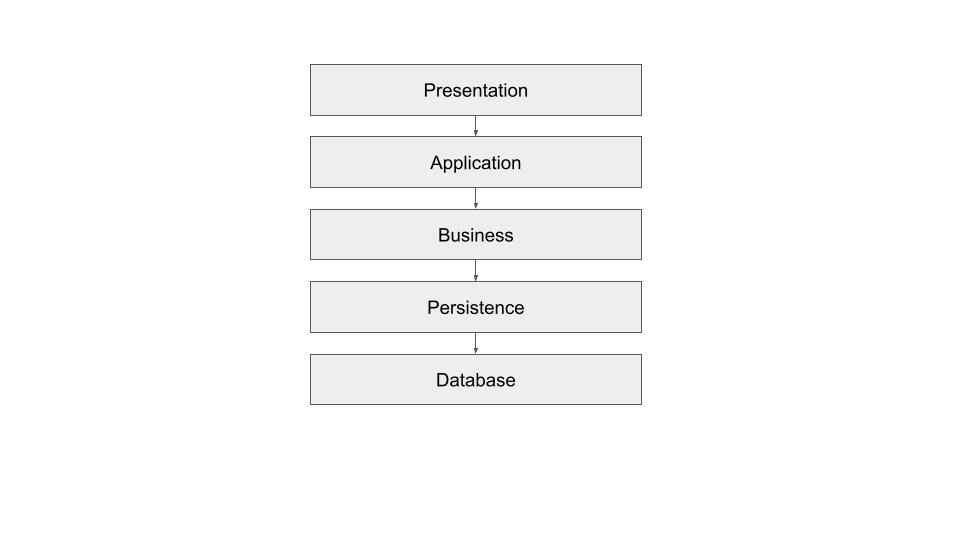
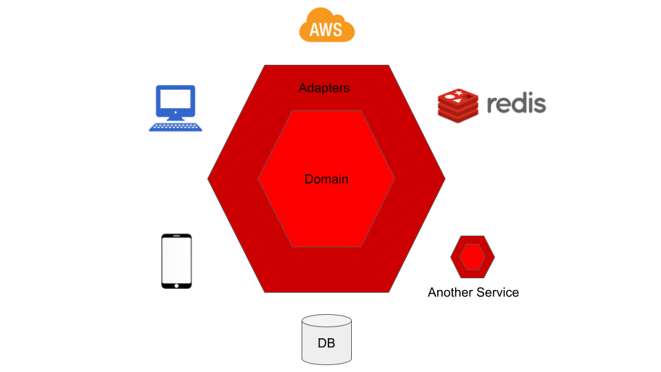
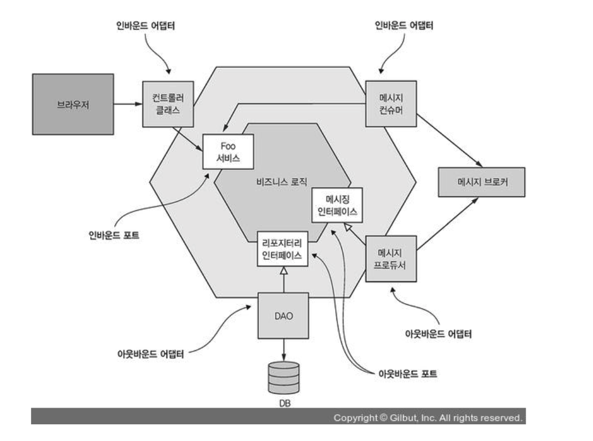
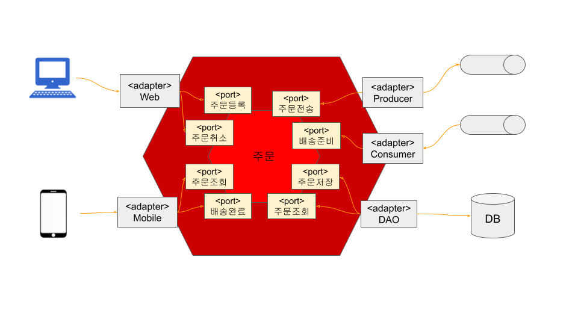

# 헥사고날(Hexagonal) 아키텍처

[comment]: <> (# 헥사고날&#40;Hexagonal&#41; 아키텍처 in 메쉬코리아)
[comment]: <> (## 인사말)
[comment]: <> (안녕하세요, 메쉬코리아 서비스개발본부에서 백엔드 개발을 하고 있는 이승호입니다.  )
[comment]: <> (저희 메쉬코리아에서는 어떻게 개발을 진행하고 있는지 궁금하실텐데요.  )
[comment]: <> (`헥사고날 아키텍처`란 주제를 통해 저희 회사의 아키텍처 관점에서 어떻게 정의되고 어떻게 개발되는 지 살짝 엿볼까합니다.)

## 아키텍처가 뭘까요?
비즈니스 요구 사항을 만족하는 시스템을 구축하기 위해서 구조를 정의한 것입니다.


## 흔히 들어봤던 레이어드 아키텍처는 뭘까요?
`레이어드 아키텍처`는 시스템을 구성하는 컴포넌트들을 `계층별`(Layered)로 나눈 아키텍처입니다.  


레이어드 아키텍처의 단점은 이렇습니다.
1. 여전히 견고한 접근방식으로 인해 오래되고 확장이 어렵고 반 SOLID 입니다.
2. 요구사항의 변경이 종종 모든 계층에 영향을 미치기 때문에 진화하기가 더 어렵습니다.
3. 모듈 일부를 배포하는 게 어렵습니다.
4. 등등 ..

## 그럼 헥사고날 아키텍처는 뭘까요?
`헥사고날`이란 사전적 의미로는 `육각형`이고 `헥사고날 아키텍처`는 `육각형 건축물`이라고 표현할 수 있겠네요.  
이 아키텍처는 소프트웨어 응용 프로그램을 설계하기 위한 모델 또는 패턴을 말합니다.  
레이어 간의 원하지 않는 종속성 및 비즈니스 로직으로 인한 사용자 인터페이스 코드의 오염과 같은 객체 지향 소프트웨어 설계의 알려진 구조적 함정을 피하기 위해 Alistair Cockburn 에 의해 발명 되었으며 2005년에 발표되었습니다.  
그리고 이 아키텍처는 "`포트 및 어댑터 아키텍처`"라고도 불립니다.


## 왜 헥사고날 아키텍처가 필요할까요?
1. 아키텍처 확장이 용이합니다.
2. SOLID 원칙을 쉽게 적용할 수 있습니다.
3. 모듈 일부를 배포하는 게 용이합니다.
4. 테스트를 위해 모듈을 가짜로 바꿀 수 있으므로 테스트가 더 안정적이고 쉽습니다.
5. 더 큰 비즈니스적 가치를 갖고 더 오래 지속되는 도메인 모델에 큰 관심을 둡니다.

## 헥사고날 아키텍처의 구성에 대해 알아볼까요?

헥사고날 아키텍처는 `내부(도메인)`와 `외부(인프라)`로 구분됩니다.
- **내부 영역** - 순수한 비즈니스 로직을 표현하며 캡슐화된 영역이고 기능적 요구사항에 따라 먼저 설계
- **외부 영역** - 내부 영역에서 기술을 분리하여 구성한 영역이고 내부 영역 설계 이후 설계

### 포트와 어댑터
포트는 내부 비즈니스 영역을 외부 영역에 노출한 API이고 인바운드(Inbound)/아웃바운드(Outbound) 포트로 구분됩니다.
- **인바운드 포트** - 내부 영역 사용을 위해 노출된 API
- **아웃바운드 포트** - 내부 영역이 외부 영역을 사용하기 위한 API

어댑터는 외부 세계와 포트 간 교환을 조정하고 역시 인바운드(Inbound)/아웃바운드(Outbound) 어댑터로 구분됩니다.
- **인바운드 어댑터** - 외부 애플리케이션/서비스와 내부 비즈니스 영역(인바운드 포트) 간 데이터 교환을 조정
- **아웃바운드 어댑터** - 내부 비즈니스 영역(아웃바운드 포트)과 외부 애플리케이션/서비스 간 데이터 교환을 조정

결국 이 구조의 핵심은 비즈니스 로직이 표현 로직이나 데이터 접근 로직에 의존하지 않는 것입니다.

## 자, 그럼 코드로 헥사고날 아키텍처를 조금 알아볼까요?
[comment]: <> (## 자, 그럼 메쉬코리아 서비스에서의 헥사고날 아키텍처를 조금 알아볼까요?)
이런 간단한 시나리오가 있다고 가정하겠습니다.

- 시나리오
1. 고객은 웹을 이용해 주문을 등록한다. (SUBMITTED)
2. 주문은 어떤(?) 처리 후 배송을 할 수 있는 상태로 변경된다. (READY)
3. 고객은 주문을 취소할 수 있다. (CANCELLED)
   단, 배송이 완료된 주문은 취소할 수 없다.
4. 기사는 배송준비 상태인 주문을 조회하고 배송한다. (COMPLETED)

먼저, 주문 도메인 모델을 살펴보겠습니다.
```java
public class Order {

  private OrderNumber orderNumber;
  private OrderStatus status;

  public void submit() {
    this.status = OrderStatus.SUBMITTED;
  }

  public void ready() {
    this.status = OrderStatus.READY;
  }

  public void complete() {
    this.status = OrderStatus.COMPLETED;
  }

  public boolean cancel() {
    if (this.status != OrderStatus.COMPLETED) {
      this.status = OrderStatus.CANCELLED;
      return true;
    } else {
      return false;
    }
  }
}
```

도메인 서비스 클래스에서 연결된 인바운드/아웃바운드 포트를 한번 보겠습니다.  
우선 OrderService는 구현체이지만 포트의 역할을 하고 있다고 볼 수 있습니다.  
Rest Controller 같은 어댑터에서 이 서비스를 호출하게 되지만 인터페이스로 정의하는 것은 오버엔지니어링일 수 있습니다.
실제 구현된 코드는 좀더 복잡하지만 이해하기 쉽게 보여드리기 위해 요약된 코드라고 봐주시면 되곘습니다.   
OrderRepository는 DB를 위한 포트이고 MessageBroker는 메세지 스트림 전송을 위한 포트입니다.
```java
public class OrderService {
  ...

  // DB를 위한 포트
  private final OrderRepository orderRepository;

  // 메세지 스트림 전송을 위한 포트
  private final MessageBroker messageBroker;

  @Transactional
  public OrderDto createOrder(CreateOrderRequestDto req) {
    Order order = createOrderRequestMapper.toEntity(req);
    order.submit();
    orderRepository.save(order);
    messageBroker.publish(order);
    return orderMapper.toDto(order);
  }

  @Transactional(readOnly = true)
  public OrderDto getOrder(UUID orderId) {
    Order order = orderRepository.findOneByExternalId(orderId);
    return orderMapper.toDto(order);
  }

  @Transactional(readOnly = true)
  public ListOrderResponseDto listOrders(Integer size, Integer page, OrderStatusDto orderStatus) {
    ...
  }

  @Transactional
  public void ready(UUID orderId) {
    Order order = orderRepository.findOneByExternalId(orderId);
    order.ready();
    orderRepository.save(order);
  }

  @Transactional
  public void complete(UUID orderId) {
    Order order = orderRepository.findOneByExternalId(orderId);
    order.complete();
    orderRepository.save(order);
  }

  @Transactional
  public void cancel(UUID orderId) {
    Order order = orderRepository.findOneByExternalId(orderId);
    order.cancel();
    orderRepository.save(order);
  }

  ...
}
```

마지막으로 어댑터 코드를 보겠습니다.   
아래는 OpenAPI로 Generate된 REST API 어댑터 코드입니다.

```java
@Controller
@RequestMapping("${openapi.hexagonal.base-path:}")
public class OrderManagementApiController implements OrderManagementApi {

    private final OrderManagementApiDelegate delegate;

    public OrderManagementApiController(@org.springframework.beans.factory.annotation.Autowired(required = false) OrderManagementApiDelegate delegate) {
        this.delegate = Optional.ofNullable(delegate).orElse(new OrderManagementApiDelegate() {});
    }

    @Override
    public OrderManagementApiDelegate getDelegate() {
        return delegate;
    }

}
```
```java
public interface OrderManagementApiDelegate {

  default Optional<NativeWebRequest> getRequest() {
    return Optional.empty();
  }

  /**
   * POST /api/orders : 주문 등록
   * 주문을 등록 한다
   *
   * @param createOrderRequestDto  (optional)
   * @return Created (status code 201)
   *         or Bad Request (status code 400)
   *         or Not Found (status code 404)
   *         or Internal Server Error (status code 500)
   * @see OrderManagementApi#createOrder
   */
  default ResponseEntity<OrderDto> createOrder(CreateOrderRequestDto createOrderRequestDto) {
    getRequest().ifPresent(request -> {
      for (MediaType mediaType: MediaType.parseMediaTypes(request.getHeader("Accept"))) {
        if (mediaType.isCompatibleWith(MediaType.valueOf("application/json"))) {
          String exampleString = "{ \"orderNumber\" : \"orderNumber\", \"id\" : \"71f3764e-b4df-4a20-9194-1682beee0991\" }";
          ApiUtil.setExampleResponse(request, "application/json", exampleString);
          break;
        }
      }
    });
    return new ResponseEntity<>(HttpStatus.NOT_IMPLEMENTED);

  }
  ...

}
```
이 외에도 이벤트 컨슈머, 커맨드 핸들러 등 다양한 어댑터가 있을 수 있고 내부 포트와 인터페이스하게 됩니다.

간략하게나마 설명드렸던 주문에 기반하여 표현한 헥사고날 아키텍처입니다.



## 마무리
개인적으로는 이 헥사고날 아키텍처는 명확한 기준이 있다기보다는 약간 추상적인 개념에 가깝다고 생각됩니다.  
그럼에도 어느정도 통찰을 할 수 있는 좋은 정보이고 개념이라고 생각합니다. 

소프트웨어는 문제 해결을 위해 지속적으로 확장되거나 변경을 필요로 합니다.  
소프트웨어 개발자는 깔끔한 아키텍처와 설계가 무엇인지를 고민하고,  
장기간에 걸쳐 수익을 창출할 수 있는 시스템을 만들기 위해 노력을 해야한다는 것은 부정할 수 없을 것입니다.   

더 좋은 개발자가 되기 위해 노력하겠습니다.   
감사합니다.


